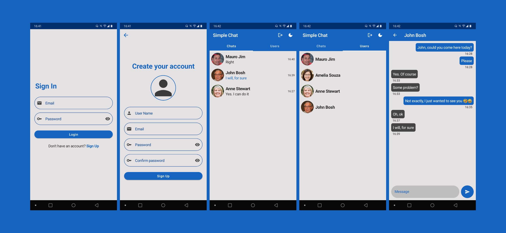
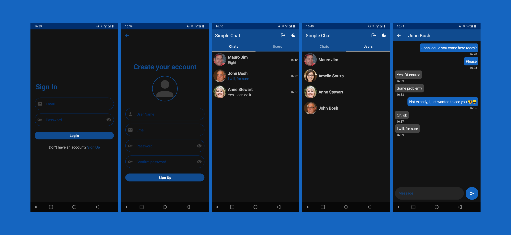

# Simple Chat with Jetpack Compose and Firebase
<p align="center">
  
  <br/>
</p>

Project created with the purpose of learning more about Firebase and practicing **Jetpack Compose** even more.

## Functionalities

• User registration with email and password.  
• One-to-one chat with registered users.  
• Listing of all registered users.  
• Light and dark theme with choice option.  

## Architecture

• Project: [MVVM](https://developer.android.com/jetpack/guide), using **Flow** and **LiveData**, in addition to dependency injection (DI) with [Dagger-Hilt](https://developer.android.com/training/dependency-injection/hilt-android). The project also uses **coroutine** with Firebase.

• Firebase Firestore:  
***users/**: All registered users.  
***chat_messages/*roomId*/messages/**: Messages from users, having as **roomId** an ID generated from the two **userId** of the conversation.  
***last_messages/*userId*/messages/*conversationUserId/***: Last messages from each user.  

## Firebase

• [Auth](https://firebase.google.com/docs/auth): Used for user authentication with email and password.  
• [Firestore](https://firebase.google.com/docs/firestore): Realtime database for saving user and conversation information.  
• [Storage](https://firebase.google.com/docs/storage): to store users' profile pictures.  

## Clone

After cloning the repository, follow the steps of [Firebase project setup](https://firebase.google.com/docs/android/setup) and add your **google-services.json** file to the project.

## Libraries used

[Navigation Compose](https://developer.android.com/jetpack/compose/navigation): used to support the Navigation Component in Jetpack Compose.  
[Acompanist](https://github.com/google/accompanist):  
- Pager: used to create a component similar to ViewPager.  
- Navigation Animation: used to create animations when using Navigation Compose. 

[Coil](https://github.com/coil-kt/coil): used for image loading. 

## Possible future features

- [ ] Push notification when sending message.  
- [ ] Profile editing/viewing.

## License 
```
MIT License

Copyright (c) 2021 Ericks

Permission is hereby granted, free of charge, to any person obtaining a copy
of this software and associated documentation files (the "Software"), to deal
in the Software without restriction, including without limitation the rights
to use, copy, modify, merge, publish, distribute, sublicense, and/or sell
copies of the Software, and to permit persons to whom the Software is
furnished to do so, subject to the following conditions:

The above copyright notice and this permission notice shall be included in all
copies or substantial portions of the Software.

THE SOFTWARE IS PROVIDED "AS IS", WITHOUT WARRANTY OF ANY KIND, EXPRESS OR
IMPLIED, INCLUDING BUT NOT LIMITED TO THE WARRANTIES OF MERCHANTABILITY,
FITNESS FOR A PARTICULAR PURPOSE AND NONINFRINGEMENT. IN NO EVENT SHALL THE
AUTHORS OR COPYRIGHT HOLDERS BE LIABLE FOR ANY CLAIM, DAMAGES OR OTHER
LIABILITY, WHETHER IN AN ACTION OF CONTRACT, TORT OR OTHERWISE, ARISING FROM,
OUT OF OR IN CONNECTION WITH THE SOFTWARE OR THE USE OR OTHER DEALINGS IN THE
SOFTWARE.
```
