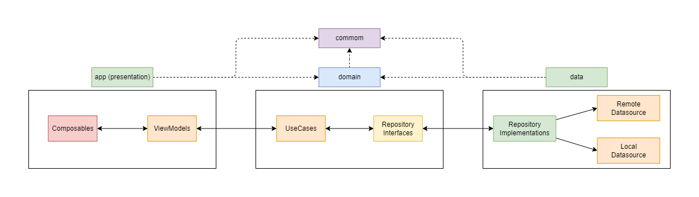

# About the project

When this project was initially created, the main objective was to improve my knowledge of Firebase and Jetpack Compose, in addition to creating a chat app with several different Firebase tools. However, in the recreation, the goal was a little more distinct from the initial idea.

The project was recreated in order to improve my knowledge in **modularization** and **clean architecture**, with a project divided into layers separated by different modules.

## Project architecture

  

## App features

- User registration with email and password;
- One-to-one chat;
- List of all registered users;
- Dark and light theme with easy user change option;
- Quick profile view.

## Clone

After cloning the repository, follow the steps of [Firebase project setup](https://firebase.google.com/docs/android/setup) and add your **google-services.json** file to the project.

## Explanation of project modules and layers

### - app

Android module. It represents the layer popularly known as "presentation", which contains all the code and logic related to the user interface, which is made using **Jetpack Compose**.

- Dependency with other modules: *common, domain and data*. (**Important note**: The inclusion of the data module in the *build.gradle.kts* is for dependency injection only, as it is not possible to access the repository implementation classes without including the data layer. *The layer data is not accessed directly by the presentation layer. For this, the use cases of the domain layer are used.*)

### - domain

Common Kotlin module, no dependencies with Android.
Represents the app's business rules. Contains all the use cases responsible for CRUD and data validation, in addition to the repository interfaces.

- Dependency with other modules: *commom*.

### - data

Android module. Represents the app's data layer, used to get/save both remote and local data. Contains the domain layer repository implementations.

- Dependency with other modules: *common and domain*.

### - common

Common Kotlin module, no dependencies with Android.
Contains some useful classes that will be used in all other layers, like preference constants and exceptions.

- It has no dependency with other modules.

## Push notifications

The old version of this project has the function of push notifications when receiving new messages, but this functionality is not present in the current project.

## Unit tests

The project has some unit tests of the validation use cases, which can be accessed in the **domain** module.

## Technologies and libraries used

- Firebase:
    - [Auth](https://firebase.google.com/docs/auth): Used to authenticate users with email and password.
    - [Firestore](https://firebase.google.com/docs/firestore): Realtime database to store user information.
    - [Storage](https://firebase.google.com/docs/storage): Used to store users' profile pictures.
- [Hilt](https://developer.android.com/training/dependency-injection/hilt-android): Dependency injection.
- [DataStore](https://developer.android.com/topic/libraries/architecture/datastore): Used for storing data such as user preferences.
- [Accompanist](https://github.com/google/accompanist):
    - **Navigation Animation**: Used for navigation with animation with **Navigation Compose**;
    - **Pager and Pager-Indicators**: Used for XML ViewPager-like component.
- [Landscapist](https://github.com/skydoves/landscapist): Used for image loading.